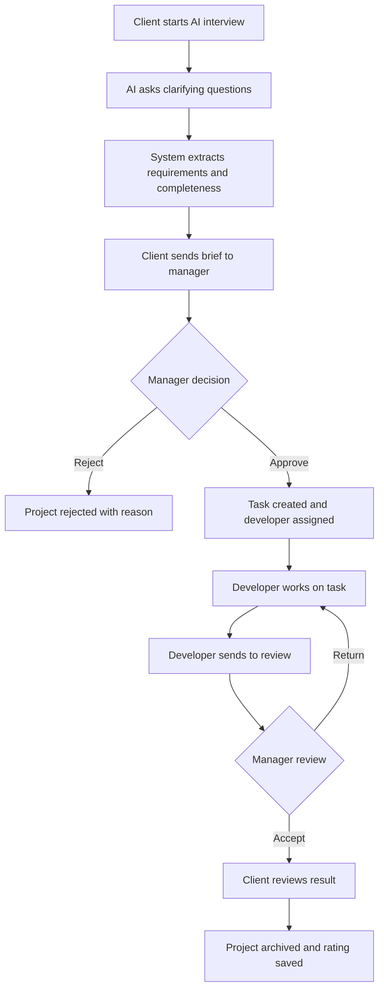

# Business analysis and validation plan

## Problem

Clients often describe digital products informally. Managers must repeatedly clarify goals, target audience, functionality, design preferences, integrations and deadlines before a technical specification can be prepared.

## Proposed solution

NeuralBrief combines an LLM-based requirements interview with a CRM workflow. The AI module collects initial requirements, while managers, developers and directors control delivery through human review and role-based dashboards.

## Actors

- Client: describes the project, sends the brief, reviews the result.
- Manager: validates the brief, assigns developers, checks delivery.
- Developer: implements assigned tasks and reports status.
- Director: monitors users, projects, reviews and audit events.

## BPMN-level process

## Effectiveness metrics for diploma defense

The project should be evaluated with a small expert experiment:

| Metric | Baseline | Target after NeuralBrief |
| --- | --- | --- |
| Average completeness of initial requirements | 40-50% | 75-85% |
| Average number of manager clarification messages | 8-12 | 3-5 |
| Average time to draft brief | 30-45 minutes | 10-15 minutes |
| Required fields filled before manager review | 4/8 | 7/8 |
| Expert rating of brief quality | 3/5 | 4/5 |

## Human-in-the-loop rule

The LLM output is treated as a draft, not as a final legal or contractual document. The manager remains responsible for final validation and approval.

## Competitive positioning

Unlike a generic chatbot dialog, NeuralBrief connects the AI interview to persistent users, saved briefs, manager approval, developer tasks, chats, notifications, audit logging, Trello synchronization and director-level monitoring.
