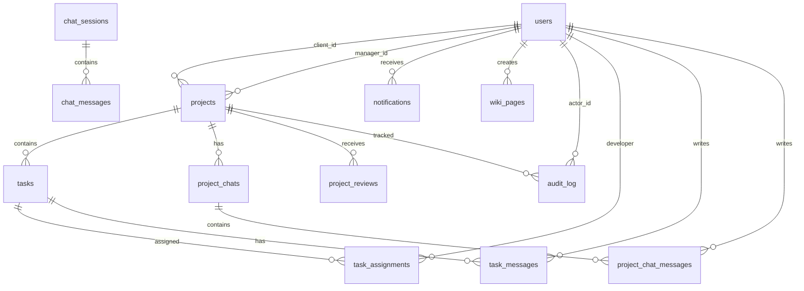

# Database ERD and relationships

NeuralBrief uses PostgreSQL as the primary source of truth for users, AI chat sessions, projects, tasks, notifications, chats, reviews and audit events.

## Main entities



## Relationship types

### One-to-many

- One client can create many projects through `projects.client_id`.
- One manager can supervise many projects through `projects.manager_id`.
- One project can contain many tasks through `tasks.project_id`.
- One task can have many messages through `task_messages.task_id`.
- One user can receive many notifications through `notifications.user_id`.
- One project can have many project chats and reviews.

### Many-to-many

Tasks and developers use the junction table `task_assignments`:

```text
tasks.id -> task_assignments.task_id
task_assignments.developer_id -> users.id
```

This allows one task to be assigned to multiple developers and one developer to work on multiple tasks.

### One-to-one

There are no strict one-to-one relationships enforced by `UNIQUE` foreign keys. Some relations may be logically close to one-to-one in the UI, but the database intentionally keeps them flexible.

## Protective constraints and triggers

- `one_draft_per_client_idx` prevents race conditions by allowing only one active draft project per client.
- `projects_updated_at_trigger`, `tasks_updated_at_trigger`, `wiki_pages_updated_at_trigger` keep `updated_at` consistent.
- `tasks_started_at_trigger` sets `started_at` when a task enters `in_progress`.
- `tasks_completed_at_trigger` sets `completed_at` when a task enters `done`.
- `projects_audit_trigger` and `tasks_audit_trigger` write changes to `audit_log`.
- `users_protect_created_at`, `projects_protect_created_at`, `tasks_protect_created_at` prevent `created_at` tampering.
